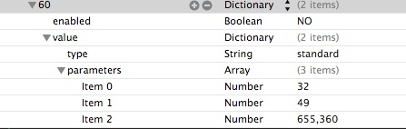
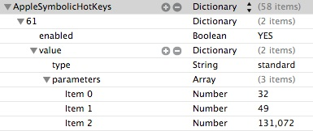

OS X
===================================
Shell scripts for automated OS X machine setup.


Requirements
------------

### Platforms
- OS X 10.9 Mavericks
- OS X 10.10 Yosemite
- OS X 10.11 El Capitan


Before Usage
----

1. Clean installing OS X via ONLINE or USB memory.
  - Hold 'C' key during startup
  - Erase OS X partation (Rename Macintosh HD volune name)
  - USB Memory 
  - Create bootable OS X installer
  - [Startup key combinations for Mach](https://support.apple.com/en-ap/HT201255)
  -- Show Startup Manager : C Key

2. Enable FileVault. [System Preferences - FileVault - Turn On FileVault...]
  Keep the recovery key, Restart it.
  * Software RAID is not support FileVault.
  http://support.apple.com/kb/ht4649

3. Install some applications from App Store, and Upgrade components.
  - Xcode (*required)
  etc...

4. for El Capitan, SIP partially disables. Enter recovery mode(%-R), run bellow command.

    ```
$ csrutil enable --without debug
or
$ csrutil disable
    ```

Usage
-----

1. Open the Terminal.app

2. Run setup command
    ```
$ export HOSTNAME="[ MY HOSTNAME ]"
$ sudo xcodebuild -license
    ```

    ```
$ git clone https://github.com/n0ts/os-x.git
$ cd os-x
$ ./setup.sh
    ```

3. Run Boxen
    ``` 
$ ./20-boxen.sh [--no-fde]
ENTER> GitHub account
    ```

4. Quit the Terminal.app, open the iTerm2.app
    ```
$ boxen terminal
    ```

5. for Development, if necessary
    ```
$ boxen [projects...]
    ```

6. Restart the OS X


Other Manual Configuration
-----

## System Preferences

### Languages & Region
- Add Japanese

### Accessibility - Audio

- Flash the screen when an alert sound occurs

### Finder Preferenes
- Slidebar: FAVORITES [$::boxen_user home directory]

### Set keyboard shortcut

- Select next source in input menu (*required reboot)
    ```
  $ open ~/Library/Preferences/com.apple.symbolichotkeys.plist

  AppleSymbolicHotKeys - new
    61 Dictionary > value > parameters > item 2 value 1572864 to 131072 (Shift)
    60 Dictionary > value > parameters > item 2 value 1048576 to 655360 (Option-Shift)
    ```




  - or copy ~/Library/Preferences/com.apple.symbolichotkeys.plist


Other Configuration
-----

- $HOME/.ssh
- Spaces & Background image
- Dashboard
- Dropbox
- Import preferences
  - com.apple.symbolichotkeys
  - Alfred 2
    - [Workflows](https://github.com/zenorocha/alfred-workflows)
  - 1Password
  - iStat
  - Bitorrensync
  - iTerm 2
    - Preferences - Load Preferences from a custom folder on URL
    - ~/Library/Preferences/com.googlecode.iterm2.plist
- Manual Preferences
  - Displays
  - Keychain
  - Finder
    - Sidebar: on $HOME and DEVICES my machine
  - TotalFinder
    - Dock: all ON
    - Menus: all ON
    - Visor: Option + F, Hide on ESC, 0.2 sec
    - Sidebar: all ON
  - TotalTerminal
    - Activation: Option + T
  - Bartender
  - Screen Savers
  - Firefox
  - Chrome
  - VMware Fusion
  - Menu bar icons

- Other 3rd party software
  - ATOK


Authors
-------------------
Author:: Naoya Nakazawa (<me@n0ts.org>)
